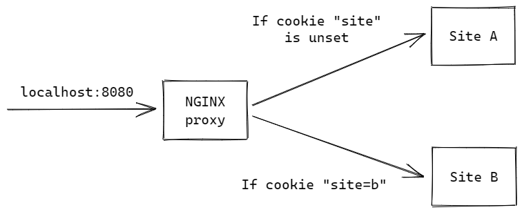

# NGINX Route by Cookie

This folder contains files to deploy an environment demonstrating NGINX's capability to route to different upstream servers based on cookie value.

The environment is deployed using Docker Compose, which includes:
- an upstream server `site-a` serving a static page with a button to set a cookie `site=b`
- an upstream server `site-b` serving a static page with a button to unset the cookie `site`
- an NGINX proxy that routes to the upstream based on the value of cookie `site`

## Instructions

1. In the terminal, run `docker compose up`.
1. In a browser, navigate to [localhost:8080](http://localhost:8080). You should see a page from `site A` with a `Toggle site` button.
1. Click on the button, and the page will be reloaded, routing you to `site B`.
