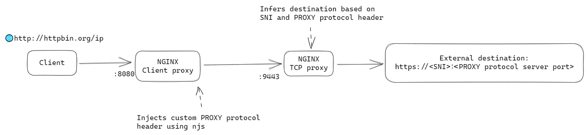

# Custom PROXY protocol

This is an example showing how a custom PROXY protocol header can be added with njs.



## Demo

To spin up the environment, run
```
docker compose up
```

Send a request to a http://httpbin.org, redirecting the traffic to `localhost:8080`, which is the client proxy
```
$ curl -k --connect-to httpbin.org:80:localhost:8080 http://httpbin.org/ip
{
  "origin": "202.171.162.98"
}
```

You show see information from the custom PROXY protocol header `1.2.3.4:1234 to 5.6.7.8:443` in the logs:
```
custom-proxy-protocol-tcp-proxy-1     | 172.20.0.2 [21/Mar/2023:06:15:43 +0000] TCP 200 5926 251 0.982 | SNI: httpbin.org | PROXY protocol: 1.2.3.4:1234 to 5.6.7.8:443
custom-proxy-protocol-client-proxy-1  | 172.20.0.1 - - [21/Mar/2023:06:15:43 +0000] "GET /ip HTTP/1.1" 200 33 "-" "curl/7.68.0"
```

## Explanation

The client proxy receives a HTTP request from the client and performs TLS origination. It then forwards the traffic to another `stream` server on the same container via a Unix socket. In the `stream` server, the `njs` script [proxy_protocol.js](./proxy_protocol.js) is executed to inject a PROXY protocol header, before sending the rest of the traffic to the upstream TCP proxy.

On the upstream TCP proxy, another `stream` server has been set up to perform TLS passthrough. Upon receiving a TCP stream from the client proxy, it extracts:
1. the `server port` in the PROXY protocol header, and
1. the `SNI` in the TLS `Client Hello`.

Finally, it proxies the traffic to `<SNI>:<server port>`.

