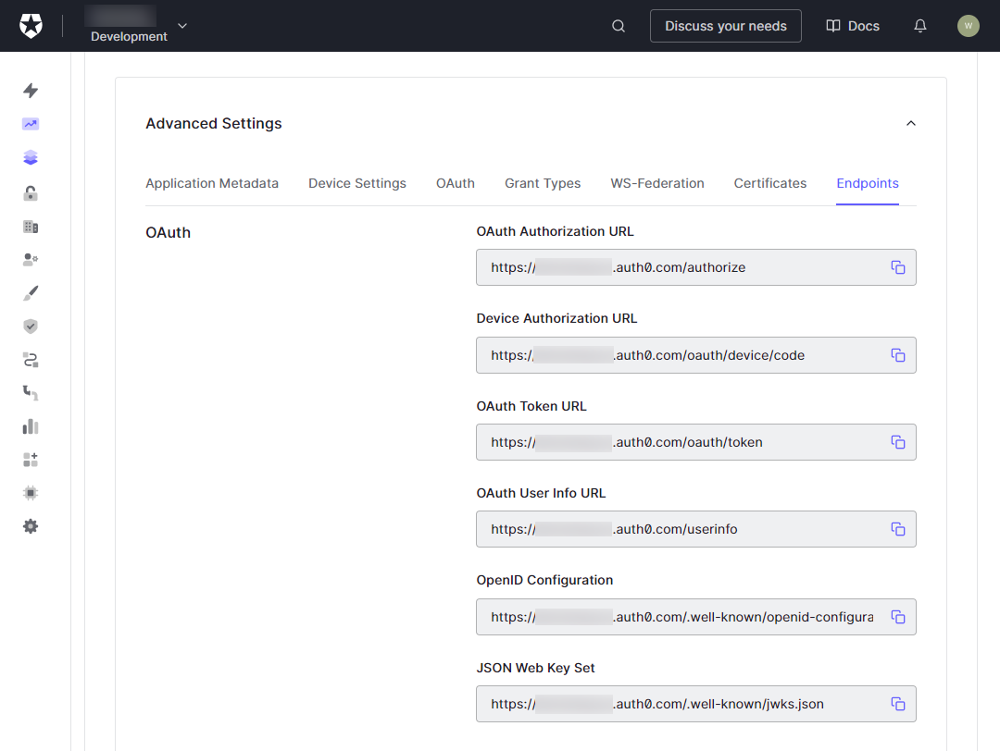

# Single Sign-On With Auth0

Learn how to enable single sign-on (SSO) with [Auth0](https://auth0.com/) for applications proxied by NGINX Plus.

___

This guide explains how to enable single sign‑on (SSO) for applications being proxied by NGINX Plus. The solution uses OpenID Connect as the authentication mechanism, with [Auth0](https://auth0.com/) as the identity provider (IdP), and NGINX Plus as the relying party.

For more information about integrating OpenID Connect with NGINX Plus, see the [documentation](https://github.com/nginxinc/nginx-openid-connect#nginx-openid-connect) for NGINX’s reference implementation on GitHub.

## Prerequisites

The instructions assume you have the following:

- An Auth0 tenant with administrator privileges.
- An NGINX Plus subscription and NGINX Plus R15 or later. For installation instructions, see the [NGINX Plus Admin Guide](https://docs.nginx.com/nginx/admin-guide/installing-nginx/installing-nginx-plus/).
- The [NGINX JavaScript module](https://www.nginx.com/blog/introduction-nginscript/) (njs), required for handling the interaction between NGINX Plus and the IdP. See installation instructions [here](https://docs.nginx.com/nginx/admin-guide/dynamic-modules/nginscript/).
- The following directive included in the top-level (“main”) configuration context in /etc/nginx/nginx.conf, to load the NGINX JavaScript module:
    ```
    load_module modules/ngx_http_js_module.so;
    ```

## Configuring Auth0

> Note: The following procedures reflect the Auth0 GUI at the time of publication, but the GUI is subject to change. Use this guide as a reference and adapt to the current Auth0 GUI as necessary.

### Configuring Auth0 Application

1. Log in to your Auth0 Dashboard at [manage.auth0.com](https://manage.auth0.com/).
1. In the side panel, click on **Applications**, then **Applications**.
1. On the **Applications** page, click on the **Create Application** button.
    
1. On the **Create application** pop up, provide a **Name** for the application, and select **Regular Web Applications** as the application type to use the [Authorization Code Flow](https://auth0.com/docs/get-started/authentication-and-authorization-flow/authorization-code-flow). Click on **Create** when done.
    
1. You should be redirected to the **Application** page. Click on the **Settings** tab. Take note of the **Client ID** and **Client Secret**.
    
1. Scroll down to the **Application URIs** section, in the **Allowed Callback URLs** field, type the URI of the NGINX Plus instance including the port number, and ending in **/_codexch**. Here we’re using http://nginx-plus-app:8080/_codexch.

    Notes:
    - For production, we strongly recommend that you use SSL/TLS (port 443).
    - The port number is mandatory even when you’re using the default port for HTTP (80) or HTTPS (443).

    
1. Scroll down to the bottom and expand the **Advanced Settings**. Click on the **Endpoints** tab and take note of the **OpenID Configuration** URL.
        
1. Click on the **Save Changes**.

### Configuring User Database

> For the purpose of this documentation, we will managing user accounts via an Auth0 Database.

1. In the side panel, click on **Authentication**, then **Database**.
1. On the **Database Connections** page, click on the **Create DB Connection** button.
    
1. On the **New Database Connection** page, type a value in the **Name** field. Click on **Create** when done.
    
1. On the **database** page that opens, click on the **Applications** tab, and click on the toggle button next to the application created in the previous section to enable the application to use this database.
    

### Configuring An Application User

1. In the side panel, click on **User Management**, then **User**.
1. On the **Users** page, click on the **Create User** button.
    
1. In the **Create user** pop up, fill in the **Email** and **Password** of the test user account, and for the **Connection** field, select the **database** created in the previous section.
1. Click on the **Create** button.
    

The user should receive an email to the email address provided. Once the user verifies their account by clicking on the link in the email, the account creation process is complete.

## Configuring NGINX Plus

Configure NGINX Plus as the OpenID Connect relying party:

1. Create a clone of the [nginx-openid-connect](https://github.com/nginxinc/nginx-openid-connect) GitHub repository.
    ```
    $ git clone https://github.com/nginxinc/nginx-openid-connect
    ```
1. Run the **configure.sh** script, providing the values obtained from the Auth0 application settings to the corresponding flags:
    ```
    ./nginx-openid-connect/configure.sh \
        --auth_jwt_key request \
        --client_id <Client ID> \
        --client_secret <Client Secret> \
        <OpenID Configuration URL>
    ```
1. In **frontend.conf**, update the server in **my_backend** upstream to your application address that you want to provide OIDC authorization for, e.g.:
    ```
    upstream my_backend {
        zone my_backend 64k;
        server my-backend-app.com:80;
    }
    ```
1. In **openid_connect.server_conf**, add the following directive to the `/_jwks_uri` and `/_token` locations:
    ```
    proxy_set_header    Accept-Encoding "gzip";
    ```
1. Copy these files from the clone to **/etc/nginx/conf.d** directory on the host machine where NGINX Plus is installed:
    - **frontend.conf**
    - **openid_connect_configuration.conf**
    - **openid_connect.js**
    - **openid_connect.server_conf**
1. Reload the NGINX configuration
    ```
    sudo nginx -s reload
    ```

## Testing The Setup

1. In a browser, enter the address of your NGINX Plus instance. You should be directed to the Auth0 login page, as shown in the example below:
    
1. Try to log in using the credentials of the user created in the Auth0 database.

## Troubleshooting

See the [Troubleshooting](https://github.com/nginxinc/nginx-openid-connect#troubleshooting) section at the [nginx-openid-connect](https://github.com/nginxinc/nginx-openid-connect) repository on GitHub.
