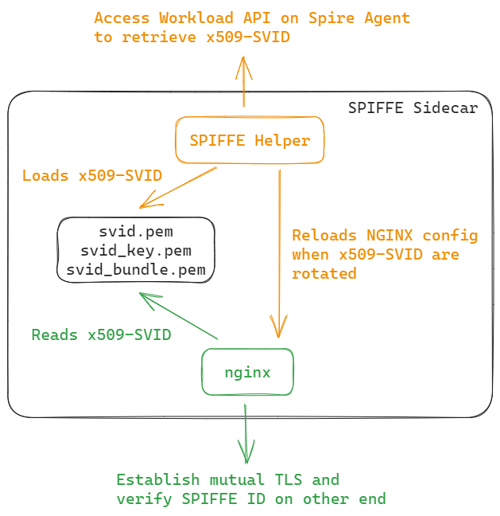
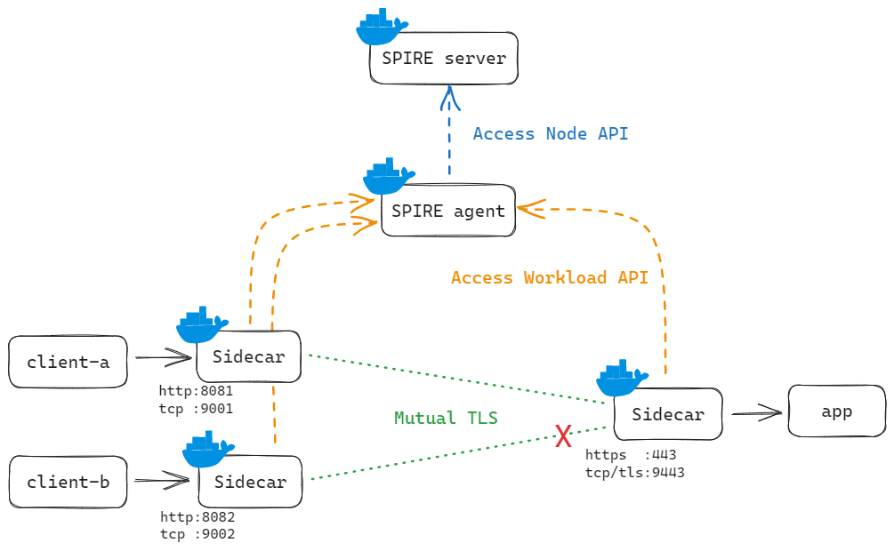

# NGINX as SPIFFE Sidecar

This repo showcases the use of NGINX as a SPIFFE sidecar, enabling workloads to participate in a [Secure Production Identity Framework for Everyone (SPIFFE)](https://spiffe.io/docs/latest/spiffe-about/overview/) environment.



The sidecar performs the following:
- uses [SPIFFE Helper](https://github.com/spiffe/spiffe-helper) to periodically retrieve [SPIFFE Verifiable Identity Document (SVID)](https://spiffe.io/docs/latest/spiffe-about/spiffe-concepts/#spiffe-verifiable-identity-document-svid) in the form of x509 certificates
- uses NGINX to load the above x509-SVID for establishing mutual TLS connections between client and app, as well as to perform authorization based on the DNS name/SPIFFE ID

## Demo



To run the demo, first start up the environment:
```
# Generate required x509 key pairs
./scripts/init.sh

# Start Docker containers
docker compose up -d
```

All Docker containers should now be running, and the SPIRE agent should have been attested to the SPIRE server [using an existing x509 certificate](https://spiffe.io/docs/latest/spire-about/spire-concepts/#node-attestors) created in the first step. You can verify this by running:
```
$ docker compose exec spire-server ./bin/spire-server agent list
Found 1 attested agent:

SPIFFE ID         : spiffe://example.org/spire/agent/x509pop/bb5c70375ad03408f0e4c3cc663739f5d1849cc4
Attestation type  : x509pop
Expiration time   : 2023-07-24 06:41:28 +0000 UTC
Serial number     : 202167881933723181818267617369223000065
Can re-attest     : true
```

Store the SPIFFE ID of the agent in the `AGENT_SPIFFE_ID` environment variable:
```
export AGENT_SPIFFE_ID="<SPIFFE ID retrieved from previous step>"
```

Next, register the `app` and `client-a` workloads on the SPIRE server with the following scripts:
```
./scripts/register-app.sh
./scripts/register-client-a.sh
```

Allow up to a minute for the SVID to be picked up by SPIFFE Helper and loaded by NGINX with the `proxy_ssl_*` and `ssl_*` directives, then send a HTTP request against `localhost:8081` which is mapped to `client-a:80`:
```
$ curl localhost:8081
OK
```

TCP stream is also supported on port `9001`, which maps to `client-a:9000`:
```
$ nc -w1 localhost 9001
ok
```

## Negative test

To verify that NGINX is validating the client SPIFFE ID, register the second client `client-b` with a SPIFFE ID not in the allow list stored in the [spiffe.js](./docker/workload/app/njs/spiffe.js) NJS script:
```
./scripts/register-client-b.sh
```

Allow up to a minute for the SVID to be picked up by SPIFFE Helper and loaded by NGINX, then send a HTTP request against `localhost:8082` which maps to `client-b:80`:
```
$ curl localhost:8082
<html>
<head><title>403 Forbidden</title></head>
<body>
<center><h1>403 Forbidden</h1></center>
<hr><center>nginx/1.25.1</center>
</body>
</html>
```

Testing against the TCP proxy at `localhost:9001`, which maps to `client-b:9000`, should not return anything:
```
$ nc -w1 localhost 9002
$
```

The following message should also be logged in both tests
```
[error] 309#309: *7 js: 'spiffe://example.org/client-b' is NOT in the allow list for accessing this endpoint.
```
